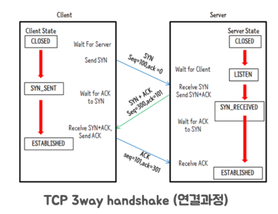
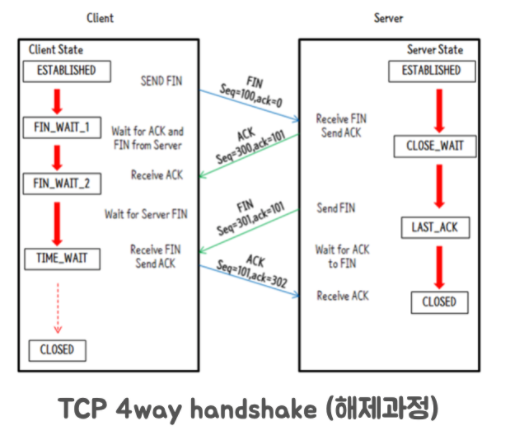

# TIME_WAIT 소켓이 서비스에 미치는 영향

## TCP 통신 과정

TIME_WAIT 에 대해서 이야기 하기 전에 먼저  TCP 통신 과정을 살펴보자.

다음 그림은 TCP 에서 통신을 하기 위해서 처음 연결을 맺는 3-way handshake 과정이다.

- 연결을 시도하려는 쪽이 SYN 패킷을 보내고, 연결 시도를 받는 쪽은 SYN + ACK 패킷을 보내게 된다.
- 그 다음 처음 연결을 시도하는 쪽이 SYN + ACK 패킷을 받고 ACK 패킷을 보내게 되면서 연결을 맺게 된다.

다음 그림은 통신을 모두 마친 후 연결을 종료하는 4-way handshake 과정이다.

- 먼저 연결을 끊으려는 쪽이 FIN 패킷을 보내게 되고 연결 끊음을 당한 쪽은 FIN 패킷을 받고 CLOSE_WAIT 상태가 된다. 그리고 ACK 패킷을 보낸다.
- 이후 연결 끊음을 당한 쪽은 FIN 패킷을 보내서 종료 준비가 완료되었다고 보내고 연결 끊음을 시도했던 쪽은 FIN 패킷을 받으면 TIME_WAIT 상태가 된다. 이후 상대방이 완전히 연결을 종료하면 된다는 ACK 패킷을 보내고 MSL (Double Maximum Segment Life) 동안 기다리고 종료된다. (이때 MSL 은 2 분정도 된다.)

TIME_WAIT 는 먼저 연결을 끊으려는 쪽에서 나오는 상태이며 문제는 MSL 시간 동안의 소켓 고갈이다.

- TIME_WAIT 소켓이 얼마나 있는지 확인하기 위해서는 ``netstat -napo | grep -i time_wait`` 를 통해서 볼 수 있다.
- 소켓 고갈은 포트 고갈로 인해서 애플리케이션 측에서 타임아웃이 발생하는 문제다. 로컬 포트가 없다면 외부와 통신을 할 수 없다.

그리고 잦은 TCP 연결 맺기/끊기는 서비스의 응답 속도 저하를 일으킬 수도 있다. 이 문제를 막기 위해서 Client 측은 Connection pool 을 Server 측은 Keep-alive 설정을 해서 소켓을 재사용할 수 있다.

- keep-alive 는 세션을 한번 맺어놓으면 그 연결을 계속해서 유지하면서 요청을 처리하는 방식이다.

## TIME_WAIT 의 상태와 존재 이유

TIME_WAIT 의 상태는 왜 존재할까? 이 이유는 연결을 끊으려고 시도했던 쪽이 마지막으로 ACK 패킷을 보내게 되는데 이 패킷이 유실될 가능성이 있기 때문이다.

위의 과정을 보면 연결 끊음을 당하려는 쪽에서 FIN 패킷을 보내게 되고 연결 끊음을 시도했던 쪽이 TIME_WAIT 상태가 되면서 ACK 패킷을 보내게 된다.

여기서 ACK 패킷이 유실되었다면 연결 끊음을 당한 쪽은 자신이 보낸 요청에 응답이 안와서 다시 FIN 패킷을 보내게 된다.

근데 TIME_WAIT 상태가 없거나, 너무 짧은 경우라면 이 FIN 패킷에 응답을 할 수 없어서 정상적인 종료가 불가능하다.

## Case Study - nginx upstream 에서 발생하는 TIME_WAIT

다수의 TIME_WAIT 가 발생하게 되는 실제 경우를 보자.

보통 Java 기반의 어플리케이션을 개발하게 되면 웹 서버로 톰캣 (tomcat), 네티 (netty) 를 이용하게 되는데 이를 앱 서버라고 하겠다.

그리고 이런 앱 서버 앞단에 요청을 처음 맞는 nginx 같은 서버를 두게 된다. 이를 웹 서버라고 두겠다.

앱 서버의 keep-alive 없이 서비스를 운영하게 되면 웹 서버에서 들어온 요청을 앱 서버로 전달해야 하는데 이때 TCP 연결 맺음/끊기 가 반복되게 되면서 TIME_WAIT 상태의 소켓이 많아져서 문제가 된다.